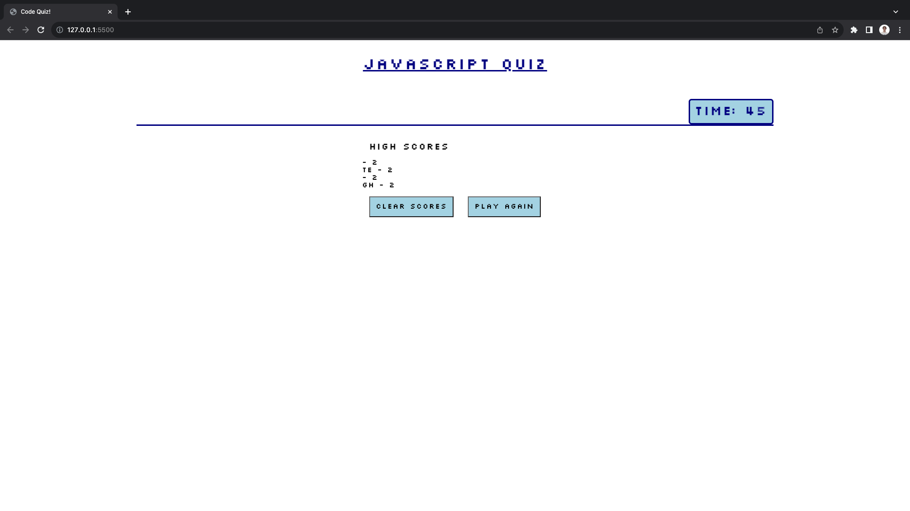

# MC- javaScript Quiz

## Description

This app is a multiple choice JavaScript quiz with a running clock and the ability to save/erase past scores/users.

## Installation

N/A

## Usage

You first click on the start button to begin. then you are presented with your first question and may advance by clicking your answer. if your answer is incorrect the clock loses 4 seconds. once all questions are answered or the clock reaches 0 then the end screen is shown which displays your score and an input section to add initials to your score. when you click save score you are taken to an end screen that shows any saved past scores and two buttons to either clear the saved scores or to play the quiz again. 

## Credits

N/A

## License

refer to LICENSE in the repo.
